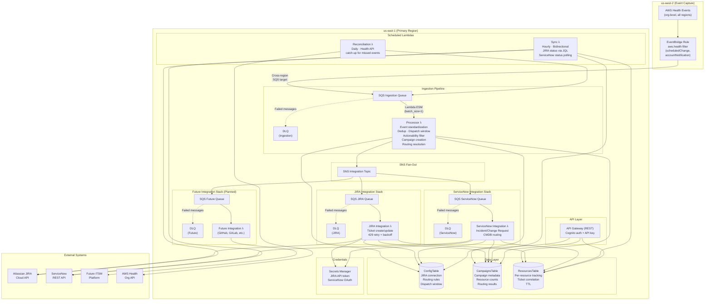

# Compass — AWS Health → ITSM Integration

Route AWS Health events into your ITSM platform (JIRA, ServiceNow) with bidirectional status tracking, automated ticket lifecycle management, and centralized campaign visibility.

> **📌 Beta release.** Compass is a reference sample — an example integration pattern, not a finished or supported product. Its JIRA and ServiceNow integrations have been tested and are working, but this is a **beta**: it is under active development, its interfaces and behavior will change, and it is **not intended for production use** in its current state. It is built and validated against general, commonly-configured JIRA and ServiceNow instances; deployments with customized workflows, non-standard fields or permissions, or custom authentication will likely need adaptation. Treat it as a starting point — evaluate and adapt it to your own environment before any production use. If you are an AWS customer with a specific use case, a non-standard configuration, or issues getting it working, your AWS account team can help. The `/api/status` endpoint reports `version: beta` to reflect this.

---

## Architecture



### Multi-Region Strategy

| Region | Role | Components |
|--------|------|------------|
| **us-west-2** | Event Capture | EventBridge rule only — AWS Health [simplified integration](https://docs.aws.amazon.com/health/latest/ug/cloudwatch-events-health.html) pattern. A single rule in US West (Oregon) captures org-level `aws.health` events from all standard partition regions and forwards to us-east-1 via cross-region SQS target. |
| **us-east-1** | Primary | All Lambdas, DynamoDB tables, API Gateway, Secrets Manager, SNS, SQS queues. Required by the AWS Health Organizational View API. |

The Health Org API is available only in us-east-1. All processing infrastructure deploys there regardless of the customer's primary operating region. The EventBridge rule in us-west-2 uses the AWS Health **simplified integration** pattern: a single rule in US West (Oregon) automatically aggregates Health events from all standard partition regions. This eliminates the need to configure per-region rules at the cost of high-availability (acceptable — daily reconciliation is the safety net). This is a functional region split, not a multi-region HA deployment. DynamoDB tables are single-region in us-east-1.

### Infrastructure Footprint

| Resource | Count | Notes |
|----------|-------|-------|
| AWS Lambda functions | 7 (default) | Default deploy: Processor, Sync, Reconciliation, Telemetry, API, Cognito Authorizer, JIRA Integration. **+2 optional** behind CDK context flags: ServiceNow Integration (`-c deploy_servicenow=true`) and the test Event Generator (`-c deploy_test_tools=true`) — 9 with full opt-in. |
| Amazon SQS queues | 5 (default) | Ingestion + DLQ, EventBridge delivery DLQ (us-west-2), JIRA + DLQ. **+2 optional**: ServiceNow + DLQ when `-c deploy_servicenow=true` (7 with full opt-in). |
| Amazon SNS topics | 3 | Integration fan-out (us-east-1) + 2 operational-alert topics (`OpsAlertsTopic` us-east-1, `OpsAlertsTopicWest` us-west-2) for CloudWatch alarm notifications. |
| Amazon DynamoDB tables | 3 | `compass-config`, `compass-campaigns`, `compass-resources` |
| Amazon S3 buckets | 2 | Dashboard hosting, payload offload for large events (>200KB) |
| Amazon CloudFront distributions | 1 | Dashboard HTTPS delivery |
| Amazon API Gateway | 1 | REST API with Cognito auth + API key |
| AWS Secrets Manager secrets | 1 (default) | JIRA credentials. **+1 optional**: ServiceNow credentials when `-c deploy_servicenow=true`. |
| Amazon EventBridge rules | 4 (default) | Health events (us-west-2) + hourly sync + daily reconciliation + daily telemetry (us-east-1). **+1 optional**: test Health-event rule when `-c deploy_test_tools=true`. |
| Amazon Cognito | 1 | User Pool + App Client for dashboard authentication |
| AWS WAF WebACLs | 2 | REGIONAL (API Gateway `prod` stage, in CompassApi) + CLOUDFRONT (dashboard distribution, in CompassCore). Both us-east-1. Enforcing (`block`) by default. |
| Amazon CloudWatch Logs groups (WAF) | 2 | `aws-waf-logs-compass-api`, `aws-waf-logs-compass-cloudfront` — credential headers (`authorization`, `x-api-key`) redacted; 30-day retention |
| **Total** | **~32 (default)** | Counts above are for a **default deploy** (no ServiceNow, no test tools); full opt-in adds the ServiceNow Lambda/queues/secret and the test Event Generator (~36). Estimated monthly cost: **~$18.88/mo (~$19/mo)** at 10K events/month — **AWS WAF is the dominant line item (~$18.02/mo)**. WAF cost is ~99% fixed fees (2 WebACLs × [$5 base + 4 rule/group line items]) and is **traffic-independent** at this volume; the prior ~$0.86/mo non-WAF baseline is unchanged. |

---

## Business Context

AWS Health surfaces actionable events — Planned Lifecycle Events (PLEs) such as version deprecations, certificate expirations, and maintenance windows — but these findings often terminate at the AWS Console and email notifications. Enterprise operations teams, meanwhile, work in ITSM platforms (JIRA, ServiceNow) where work gets assigned, tracked, and resolved.

Compass bridges that gap by routing AWS Health events into the customer's ITSM system of record with bidirectional status tracking, so operational teams can act on Health findings within the tools they already use to run their environments.

---

## Capabilities

Compass is a beta reference sample. A single deployment integrates with **either JIRA or ServiceNow** (dual-platform / per-row operation is planned, not delivered). The capabilities below describe what the pattern does today.

### Event Ingestion

- Real-time ingestion via EventBridge rule (org-level, us-west-2) with cross-region forwarding to SQS in us-east-1
- SQS Ingestion Queue → Processor Lambda via Lambda Event Source Mapping (batch_size=1)
- Daily scheduled reconciliation via Health API call — catches any events missed by EventBridge; also triggerable on-demand
- Filter by event category (`scheduledChange`, `accountNotification`) and actionability (`ACTION_REQUIRED`, `ACTION_MAY_BE_REQUIRED`)
- Dispatch window — customer selects which event type codes create tickets (prefix wildcards supported, e.g., `AWS_EKS_*`)
- Deduplication by campaign ID — re-ingestion updates existing campaigns, preserves ticket status
- Paginated EventBridge events handled as incremental updates (each page appends resources to existing campaign)
- Configurable `filterBackupEvents` option for customers with multi-region EventBridge rules
- Date format normalization (EventBridge RFC 2822 → ISO 8601)
- Handles both `affectedEntities` and `affectedResources` field names defensively (Health schema variants)
- `page` field coerced from string to int (EventBridge delivers as string)

### Tag-Based Routing

- Route events to assignment targets based on configurable tag values (e.g., `Team`, `Environment`) — routing logic lives in the Processor Lambda, requiring zero additional infrastructure
- Routing resolution chain: tag value → `TAG_ROUTING#` lookup → account ID → `ROUTING#` lookup → `ROUTING_DEFAULT` (orphan queue)
- Failover is designed to prevent silently dropped events regardless of tag coverage
- A routing coverage metric tracks the percentage of events routed by tag vs. account vs. default
- The onboarding wizard includes a tag routing configuration step (tag key selection, tag value → target mapping)
- Customers can start with account-only routing and adopt tag routing incrementally
- Tag values are available at ticket creation time, enabling tag-based routing and tag-enriched tickets

### JIRA Ticket Management

- Two ticket templates: events WITH resources (resource ARNs, status table, burndown) and events WITHOUT resources (account-level metadata only)
- Account-to-JIRA-project routing via ConfigTable `ROUTING#accountId` keys with configurable issue type
- Orphan queue: unmapped accounts route to a customer-configured default JIRA project (`ROUTING_DEFAULT`), with alerting at 10+ tickets
  - The orphan **alert** is ticket-based: the dashboard headline card/banner read the sync-backed **ticket** count from `GET /api/config/routing/orphan-status` (>10 tickets fires the alert). The `GET /api/routing/orphans` endpoint is a separate per-account **resource** breakdown (`defaultRoutedResourceCount` / `accounts[].resourceCount`) for the "which accounts to map first" workflow — not the alert source. Default-routed events still count as routed in Routing Coverage.
- Ticket updates when resource status changes (PENDING → RESOLVED) — PLE campaigns only
- Daily burndown comments showing current PENDING/RESOLVED counts
- CSV attachment for campaigns with >100 resources per ticket
- JIRA labels derived from tag values (e.g., `team-platform`, `env-production`) replacing raw account IDs
- JIRA API rate limit handling — 429 retry with exponential backoff; reserved concurrency (=2) on the JIRA Lambda prevents burst overload
- Configuration validation at setup time — test JIRA connection, validate project keys, catch bad credentials before any tickets are created

For full JIRA setup, see [`docs/JIRA_SETUP.md`](docs/JIRA_SETUP.md).

### ServiceNow Ticket Management (beta)

- Create incidents and change requests via the ServiceNow REST API with AWS metadata
- Bidirectional sync — ticket status flows back to the tracking layer
- Routing to ServiceNow assignment groups (by `sys_id`), by account and by tag value
- OAuth 2.0 authentication for enterprise ServiceNow instances
- ServiceNow ticket execution is verified working (one change request per campaign by default). Some enhancements — per-resource status write-back detail, CSV attachment, and CMDB-based routing — are not yet delivered; see [`docs/SERVICENOW_SETUP.md`](docs/SERVICENOW_SETUP.md) for the current state.

### Bidirectional Sync

- Hourly poll of JIRA via batch JQL search, or ServiceNow status polling
- Map ITSM status to normalized states (Created, In Progress, Closed). For JIRA this uses `statusCategory.key`, which handles custom workflows without per-workflow configuration.
- Write ticket status back to ResourcesTable at resource and campaign level
- Campaign completion % calculated from ticket statuses

### Platform-Aware Dashboard

- The dashboard follows the configured platform. A ServiceNow-only deployment renders ServiceNow routing (assignment group, record type) and ServiceNow-worded labels and readiness messages; a JIRA-only deployment renders JIRA routing (project, issue type) and JIRA-worded messages.
- Platform is derived from the `platforms` array returned by `GET /api/config/summary` (for example `["jira"]` or `["servicenow"]`), emitted at the top level of the response.
- A fully-configured ServiceNow-only deployment is not shown a false "configure your JIRA connection" prompt and is not misclassified as a first-time user solely because a JIRA-named field is absent. A JIRA-only deployment behaves identically for the JIRA path.

### Configuration & Deployment

- Single `cdk deploy` creates all infrastructure — requires the `ops_alert_email` context parameter (CloudWatch alarm → SNS ops-alert subscriber address); all other configuration is post-deploy via the onboarding wizard
- ITSM credentials stored in Secrets Manager (never in environment variables or DynamoDB)
- 4-step onboarding wizard: ITSM connection → account routing (with tag routing config) → dispatch window → review & activate
- API Gateway with Cognito authentication and API key authentication
- Bulk import for account mappings (CSV or JSON, with preview and validation)

---

## How the Architecture Works

### 1. Tag-Based Routing — Zero-Infrastructure

Compass can route events to assignment targets based on configurable resource-level or account-level tag values. Tag routing is a ConfigTable lookup plus a small amount of routing logic in the Processor Lambda — no additional enrichment infrastructure. Tag values are available at ticket creation time, enabling tag-based routing and tag-enriched tickets.

### 2. Direct SQS → Lambda ESM

The ingestion pipeline uses a direct SQS → Lambda Event Source Mapping. The Processor Lambda receives events from the SQS Ingestion Queue, extracts tag values, standardizes the event, creates campaigns in DynamoDB, resolves routing, and publishes to SNS. Direct ESM is testable, has independent 15-minute Lambda timeouts, and avoids resource-replacement deployment risk.

### 3. SNS Fan-Out — Decoupled Integration Stacks

The Processor Lambda publishes standardized events to an SNS Integration Topic. Each ITSM integration subscribes via its own dedicated SQS queue. All integrations receive every event and independently decide whether to act. Adding a new ITSM platform means deploying a new Integration Stack that subscribes to the same SNS topic — zero changes to the Core Stack.

All integration stacks implement a common `ITSMClient` plugin interface (`resolve_core/itsm_client.py`). New platforms are added by implementing the interface (client + formatter + handler) and deploying a new CDK stack — no changes to core infrastructure or existing integrations.

### 4. ConfigTable — Single Routing Source of Truth

A single DynamoDB ConfigTable supports tag routing via `TAG_ROUTING#value` keys, account routing via `ROUTING#accountId` keys, and a `ROUTING_DEFAULT` fallback. One table, one lookup path, one place to configure. A `ROUTING_STRATEGY` item controls whether tag routing is active and which tag key to use.

### 5. CDK (Python) — Single Deployment Command

All infrastructure is defined in AWS CDK with Python. `cdk deploy` creates everything: EventBridge rules, Lambdas, DynamoDB tables, SQS queues, SNS topics, API Gateway, Secrets Manager, IAM roles. No manual resource creation, no CloudFormation parameter files, no S3 bucket dependencies for Lambda packages.

### 6. Selective Routing — Graceful No-Op

Integration Lambdas look up the event's routing in the ConfigTable. If no mapping exists for the event's tag value or account, the integration routes to the default project (orphan queue). Events are tracked in the ResourcesTable for dashboard visibility regardless of routing outcome. Unmapped events are visible, not silent.

### 7. Integration Parity — Identical Patterns

JIRA and ServiceNow integrations follow the same structural pattern: dedicated SQS queue → Integration Lambda → routing lookup → ticket create/update → tracking write. The same routing priority order, error handling, retry logic, and DLQ behavior apply to both. This makes adding new integrations predictable and testable.

### 8. DLQs Everywhere — No Silent Message Loss

Every SQS queue has a dead-letter queue: the ingestion queue and each integration queue. Failed messages are captured, not dropped. Combined with structured error logging (event ARN, failure reason, HTTP status, timestamp), failures are designed to be diagnosable.

---

## Routing Resolution

When a Health event arrives, routing resolves in this order:

1. **Tag routing** — If `ROUTING_STRATEGY.mode == "tag"`: extract the configured tag value → look up `TAG_ROUTING#{value}` in ConfigTable → target
2. **Account routing** — `ROUTING#{affectedAccount}` → target
3. **Fallback** — `ROUTING_DEFAULT` → default target (orphan queue)
4. **Error** — If no default configured → log error, skip ticket creation

All three routing levels are supported from day one. The ConfigTable schema accommodates tag routing, account routing, and service routing with additive key patterns — no migration required. The routing result is carried on the event the Processor publishes, so integration Lambdas never re-run routing logic.

---

## DynamoDB Tables

| Table | Key Schema | Purpose |
|-------|------------|---------|
| **ConfigTable** | `pk` (string) | JIRA connection (`JIRA_CONNECTION`), routing rules (`ROUTING#accountId`, `ROUTING_DEFAULT`), tag routing (`ROUTING_STRATEGY`, `TAG_ROUTING#value`), dispatch window (`DISPATCH_PRESET`, `DISPATCH_RULE#*`), routing suggestions (`ROUTING_SUGGESTION#accountId`). Single partition key; all config types coexist with prefix-based key patterns. |
| **CampaignsTable** | `campaignId` (string) | Campaign metadata: event ARN, service, deadline, description, resource counts (pending/resolved), campaign status (ACTIVE/FILTERED/COMPLETED), campaign type (resource-level/account-level), routing result. GSIs: `service-startTime-index`, `status-updatedAt-index`. |
| **ResourcesTable** | `campaignId` (string) + `trackingKey` (string) | Per-resource tracking: resource ARN, entity value, account ID, region, Health status (PENDING/RESOLVED), ticket ID, ticket status (Created/In Progress/Closed), tag values. `trackingKey` is `resourceArn` for resource-level campaigns or `ACCOUNT#affectedAccount` for account-level campaigns. GSI: `ticketStatus-index`. TTL-enabled (180 days). |

All tables use on-demand (PAY_PER_REQUEST) billing. Expected volume: 1–2 campaigns/week with hundreds of resources each — well within free tier.

---

## Design Highlights — How It Behaves

From a deployer's perspective, here is what the pattern does once deployed:

- **Tag-based routing with failover.** Compass routes events to assignment targets based on configurable tag values, with failover to account-level routing and then a default target — so no event is silently dropped regardless of tag coverage.
- **Hybrid ingestion.** Real-time capture via an EventBridge rule creates tickets when events publish, a daily Health API reconciliation catches anything missed, and an on-demand sync can be triggered from the dashboard.
- **Orphan queue for unmapped accounts.** Events for accounts with no routing mapping land in a customer-configured default project, with alerting once that queue exceeds 10 tickets.
- **Setup-time JIRA validation.** The onboarding "Test Connection" step validates the JIRA URL, credentials, and project keys before any tickets are created — bad configuration is caught up front, not at first event.
- **Resilient handling of Health event field variants.** Compass defensively reads both `affectedEntities` and `affectedResources`, normalizes date formats (EventBridge RFC 2822 → ISO 8601), and coerces the `page` field from string to int, so schema variants and pagination are handled without silent data loss.
- **Campaign deduplication.** PLEs for the same service lifecycle stream (`service:eventTypeCode`) merge into one campaign across regions; all other events dedup on `eventArn`. Centralized teams see one campaign per service PLE stream rather than one per region.

---

## Technology Stack

| Layer | Technology |
|-------|------------|
| Language | Python 3.12+ |
| Infrastructure as Code | AWS CDK (Python) |
| Compute | AWS Lambda (up to 15min timeout, 512MB memory for large campaigns) |
| Event Routing | Amazon EventBridge (rules only) |
| Messaging | Amazon SQS (with DLQs), Amazon SNS |
| Data | Amazon DynamoDB (on-demand billing) |
| Object Storage | Amazon S3 (large campaign payload offload for >200KB SNS messages) |
| Secrets | AWS Secrets Manager |
| API | Amazon API Gateway (REST, Cognito auth + API key) |
| Auth | Amazon Cognito User Pool + API key (backward-compat) |
| Edge protection | AWS WAFv2 — REGIONAL WebACL (API Gateway `prod` stage) + CLOUDFRONT WebACL (dashboard distribution); 3 AWS managed rule groups + per-IP rate rule; enforcing (`block`) by default |
| Dashboard | React 18 + Cloudscape Design System + Vite |
| Dashboard Hosting | Amazon S3 + CloudFront (HTTPS) |
| Regions | us-east-1 (primary), us-west-2 (EventBridge rule only) |
| ITSM Abstraction | ITSMClient plugin interface (supports JIRA, ServiceNow, GitHub, Azure DevOps) |
| ITSM — JIRA | Atlassian JIRA Cloud REST API v3 |
| ITSM — ServiceNow | ServiceNow REST API (ITSM + Table API) |

---

## Deployment

### CDK Stacks

| Stack | Region | Purpose |
|-------|--------|---------|
| **CompassCore** | us-east-1 | DynamoDB, SNS, SQS, Processor Lambda, S3, **CLOUDFRONT WAF WebACL** (dashboard distribution) |
| **CompassEventCapture** | us-west-2 | EventBridge rule for org-level Health events |
| **CompassJira** | us-east-1 | JIRA integration (SQS, Lambda, Secrets Manager) |
| **CompassApi** | us-east-1 | API Gateway + dashboard Lambda handlers + S3/CloudFront, **REGIONAL WAF WebACL** (`prod` stage) |
| **CompassServiceNow** | us-east-1 | ServiceNow integration (SQS, Lambda, Secrets) — optional, deploy with `-c deploy_servicenow=true` |
| **CompassTestTools** | us-east-1 | Event generator Lambda for testing (optional) |

### Quick Start

**Prerequisites:** AWS CLI configured, Node.js 20+, Python 3.12+, CDK CLI (`npm install -g aws-cdk`)

> **Cost warning:** Deploying this stack creates billable AWS resources including AWS Lambda functions, Amazon DynamoDB tables, Amazon SQS queues, AWS Secrets Manager secrets, Amazon CloudFront distributions, and **two AWS WAF WebACLs**. Estimated cost at 10K events/month is **~$18.88/month (~$19/mo)** — **AWS WAF dominates at ~$18.02/mo** (2 WebACLs × [$5 base + 4 rule/group line items]; ~99% fixed fees, **traffic-independent** at this volume). The non-WAF baseline is ~$0.86/mo. Review the [Infrastructure Footprint](#infrastructure-footprint) table for full details. Destroy the stack when no longer needed to avoid ongoing charges.

> **Required parameter — `ops_alert_email`:** Every `cdk` invocation that loads the app (`deploy`, `destroy`, `list`, `diff`, `synth`) requires the CDK context parameter `-c ops_alert_email=<address>`. This is the subscriber address for the CloudWatch alarm → SNS ops-alert topics (`OpsAlertsTopic` in us-east-1, `OpsAlertsTopicWest` in us-west-2) that notify on ingestion/JIRA/ServiceNow DLQ and Processor-error conditions. There is **no default** — synth fails immediately if it is absent, by design (fail-fast, not fail-silent). Supply it **per-invocation, at deploy time, by the operator running the command** — exactly like `-c account=<ACCOUNT>`. Two things to keep in mind when choosing the address:
> - **Recommend an access-controlled operational distribution list, not a personal inbox.** Ops-alert emails will contain this deployment's AWS account ID, region, and internal resource names (SQS queue names, Lambda function names) — see [Post-Deploy Setup](#post-deploy-setup) for the full disclosure statement.
> - **Never hardcode a literal email address in any committed script, Makefile, or CI/CD pipeline definition.** If CI/CD automation needs it, source it from a CI-level secret/variable store, the same way `account` is already handled — not from a committed file.

```bash
# 1. Clone the repository, then enter it
git clone <your-fork-or-repo-url>
cd compass

# 2. Install Python dependencies
pip install -r requirements.txt && pip install -r requirements-dev.txt

# 3. Build the dashboard
cd dashboard && npm install && npm run build && cd ..

# 4. Bootstrap CDK in both regions
npx cdk bootstrap aws://$ACCOUNT/us-east-1
npx cdk bootstrap aws://$ACCOUNT/us-west-2

# 5. Deploy all stacks (add -c deploy_servicenow=true for ServiceNow integration)
#    -c ops_alert_email=<address> is REQUIRED — supply your own operational
#    distribution list address; do not commit a literal address anywhere.
#    WAF ships ENFORCING by default. Optional WAF knobs (see docs/WAF.md):
#      -c waf_mode=count        # observe-only tuning; default is block (enforcing)
#      -c waf_rate_limit=2000   # per-IP requests / 300s window (default 2000)
npx cdk deploy --all -c account=$ACCOUNT -c ops_alert_email=<address> -c deploy_test_tools=true -c deploy_servicenow=true --require-approval never
```

CDK outputs include: `ApiUrl`, `ApiKeyId`, `DashboardUrl`, `DashboardBucketName`, `OpsAlertsTopicArn`, `OpsAlertsTopicArnWest`.

> **AWS WAF ships enforcing (`block`) by default.** Both public edges (API Gateway `prod` stage and the CloudFront dashboard distribution) are protected on every `cdk deploy` with three AWS managed rule groups plus a per-IP rate rule. See [`docs/WAF.md`](docs/WAF.md) for the deploy knobs (`-c waf_mode`, `-c waf_rate_limit`), the block-response contract, the recommended COUNT-first-then-BLOCK rollout, WAF logging, and operational runbook notes.

### Post-Deploy Verification

After deployment completes, verify the stacks are operational:

```bash
# 1. Confirm all stacks deployed successfully
# (any cdk CLI invocation that loads app.py — list/diff/synth/deploy/destroy —
#  requires the same -c account / -c ops_alert_email context used at deploy time)
npx cdk list -c account=$ACCOUNT -c ops_alert_email=<address>

# 2. Retrieve the API URL and key
API_URL=$(aws cloudformation describe-stacks --stack-name CompassApi \
  --query "Stacks[0].Outputs[?OutputKey=='ApiUrl'].OutputValue" --output text)
API_KEY_ID=$(aws cloudformation describe-stacks --stack-name CompassApi \
  --query "Stacks[0].Outputs[?OutputKey=='ApiKeyId'].OutputValue" --output text)
API_KEY=$(aws apigateway get-api-key --api-key "$API_KEY_ID" --include-value \
  --query "value" --output text)

# 3. Test the API status endpoint (health check, exempt from auth)
curl -s -H "x-api-key: $API_KEY" "$API_URL/api/status" | python3 -m json.tool
```

A successful response confirms the API Gateway, AWS Lambda functions, and Amazon DynamoDB tables are operational. The `/api/status` endpoint reports `version: beta`.

### Dashboard-Only Updates

To update dashboard assets without a full CDK deploy (e.g., after `cd dashboard && npm run build`):

```bash
aws s3 sync dashboard/dist/ s3://$DASHBOARD_BUCKET --delete --exclude "config.json"
```

> **Warning:** Never omit `--exclude "config.json"` — this file is deployed by CDK and contains runtime Cognito/API configuration that the dashboard requires to function.

### Multi-Region Deployment Order

1. **us-east-1 first** — all primary infrastructure (Lambdas, DynamoDB, API Gateway, SQS, SNS, Secrets Manager, S3/CloudFront)
2. **us-west-2 second** — EventBridge rule with cross-region SQS target pointing to the us-east-1 ingestion queue

CDK handles this ordering automatically via stack dependencies.

### Post-Deploy Setup

> **Mandatory — confirm ops-alert email subscriptions before relying on alarms.** After the first deploy, AWS SNS sends **two separate confirmation emails** to the `ops_alert_email` address you supplied — one for `OpsAlertsTopic` (us-east-1) and one for `OpsAlertsTopicWest` (us-west-2). Each subscription sits in `PendingConfirmation` state and **delivers zero notifications** until its confirmation link is clicked. A successful `cdk deploy --all` does **not** by itself prove alarm notifications work — CloudFormation allows a topic to deploy successfully with a subscription still unconfirmed. Before treating any of the 5 DLQ/error alarms (`IngestionDLQAlarm`, `ProcessorErrorAlarm`, `EventBridgeDLQAlarm`, `JiraDlqAlarm`, `ServiceNowDlqAlarm`) as monitored:
> 1. Check the inbox for `ops_alert_email` for two emails from "AWS Notifications" and click **Confirm subscription** on both.
> 2. Recommended: trigger at least one DLQ alarm end-to-end (e.g., via the test-tooling event generator forcing a downstream failure) and confirm a real email actually arrives at the subscribed address. Do not infer delivery from the alarm reaching `ALARM` state or from a green `cdk deploy` exit code alone — both can succeed while the underlying CloudWatch→SNS publish authorization is missing.
>
> **What the notification will contain:** the standard CloudWatch Alarm State Change email includes, unconditionally, this deployment's AWS account ID, region, and the alarm's underlying resource name (the SQS queue name or Lambda function name). In aggregate across all 5 alarms this reveals which ITSM platforms (JIRA, ServiceNow) are integrated and this account's internal queue/Lambda naming conventions. None of the 5 alarms expose customer Health-event data (no resource ARNs, no `affectedAccount` values, no ticket content) — they are queue-depth/error-count metrics only. Because of this account/region/resource-name disclosure, **point `ops_alert_email` at an access-controlled operational distribution list, not an individual's personal inbox.**
>
> **Caution:** Do not hardcode a literal `ops_alert_email` value into any committed script, `Makefile`, or CI/CD pipeline definition — the email address is contact information and should be supplied per-invocation by the operator running the deploy, exactly like `-c account=<ACCOUNT>` is handled today. If CI/CD automation needs it, source it from a CI-level secret/variable store, not a file checked into version control.

After deployment, complete the 4-step onboarding wizard via the dashboard or API:

> **Auth:** No users are created automatically. The Cognito User Pool is deployed empty with self-registration disabled — a fresh deploy has zero users. After deploy, an administrator must create the first user with `aws cognito-idp admin-create-user` and add them to the **Admins** group with `aws cognito-idp admin-add-user-to-group`. See [`docs/AUTH_SETUP.md`](docs/AUTH_SETUP.md) for the exact commands, groups, and first-login flow.

1. **JIRA Connection** — Provide JIRA base URL, automation account email, and API token. Choose "Test Connection" to validate. Credentials are stored in Secrets Manager.
2. **Account Routing** — Configure a default JIRA project (required).
3. **Account Routing (optional overrides)** — Add per-account overrides via manual entry, bulk CSV/JSON import, or auto-discovery from AWS Organizations.
4. **Dispatch Window** — Choose which Health events create tickets: all actionable events (default), PLEs only, or custom rules with prefix-match patterns (e.g., `AWS_EKS_*`).
5. **Review & Activate** — Confirm configuration summary and activate the integration.

> **Onboarding state semantics:** The dashboard's "JIRA configured" state (`jira.credentialsConfigured` in `GET /api/config/summary`) is derived from the `JIRA_CONNECTION` ConfigTable item's `validated` flag — i.e. it is `true` only after a successful "Test Connection" — and equals `jira.validated` on all reachable states. It is **never** inferred from the existence of the `compass/jira-credentials` Secrets Manager secret, which CDK creates unconditionally at deploy with an auto-generated placeholder value. A fresh deploy therefore correctly shows the "Setup incomplete" onboarding prompt until JIRA is connected and validated.
>
> **Platform-aware onboarding state:** The dashboard's setup guidance and returning-user detection are **platform-aware**, driven by the `platforms` array in `GET /api/config/summary` (emitted at the **top level** of the response, e.g. `["servicenow"]`, `["jira"]`, or `["jira","servicenow"]` — **not** nested under a `data` envelope). For a **ServiceNow-only** deployment (`platforms == ["servicenow"]`, ServiceNow connected and validated, JIRA never configured), readiness is derived from ServiceNow status (`servicenow.validated`) plus a configured ServiceNow default target (or account mappings), **not** from `jira.credentialsConfigured`. Such a customer is therefore **not** shown the false "Setup incomplete — configure your JIRA connection" prompt, and is not misclassified as a first-time user and re-shown onboarding solely because a JIRA-named field is absent. A **JIRA-only** deployment's onboarding state is byte-identical to the behavior described above (the platform decision resolves to JIRA whenever `platforms` is `["jira"]`, dual, or absent). See [`docs/SERVICENOW_SETUP.md`](docs/SERVICENOW_SETUP.md) for the ServiceNow-only dashboard routing experience.

### ITSM Setup

A single Compass deployment integrates with **either JIRA or ServiceNow, not both simultaneously** (dual-platform / per-row operation is planned, not delivered). Choose one platform and complete its setup guide below. Authentication for the dashboard and API is covered separately in the Auth guide.

| Guide | When to use | High-level prerequisites |
|-------|-------------|--------------------------|
| [`docs/JIRA_SETUP.md`](docs/JIRA_SETUP.md) | JIRA Cloud (`*.atlassian.net`) integration. Validated end-to-end. | A dedicated automation Atlassian account with an API token; the six project permissions (Browse Projects, Create Issues, Edit Issues, Add Comments, Create Attachments, Transition Issues) on every target project; JIRA Cloud only (Data Center not supported). |
| [`docs/SERVICENOW_SETUP.md`](docs/SERVICENOW_SETUP.md) | ServiceNow (`*.service-now.com`) integration. Beta — configuration/routing complete and ticket execution verified working (one change request per campaign by default). | Deploy with `-c deploy_servicenow=true`; active ITSM/Change Management, OAuth 2.0, and (for CMDB routing) CMDB plugins; an OAuth application (client-credentials grant) with the system property `glide.oauth.inbound.client.credential.grant_type.enabled=true` set; a dedicated integration user with the `itil` role; assignment-group `sys_id` values for routing. |
| [`docs/AUTH_SETUP.md`](docs/AUTH_SETUP.md) | Dashboard and API authentication (all deployments). | Create the first Cognito user and add them to the **Admins** group after deploy. |

In all cases, ITSM credentials are stored only in AWS Secrets Manager — never in DynamoDB, environment variables, or source control.

### Cleanup

To remove all deployed resources and stop incurring charges:

```bash
# 1. Destroy all CDK stacks
# (cdk destroy also loads app.py, so it requires the same required context
#  parameters used at deploy time — ops_alert_email can be any non-empty
#  value here since it only satisfies CoreStack's synth-time check and does
#  not need to match the originally-deployed address for teardown to work)
npx cdk destroy --all -c account=$ACCOUNT -c ops_alert_email=<address>

# 2. Manually delete DynamoDB tables (retained by default to prevent data loss)
aws dynamodb delete-table --table-name compass-config --region us-east-1
aws dynamodb delete-table --table-name compass-campaigns --region us-east-1
aws dynamodb delete-table --table-name compass-resources --region us-east-1
```

> **Warning:** Deleting DynamoDB tables permanently destroys all configuration, campaign history, and resource tracking data. This action cannot be undone. Export any data you need before deletion.

---

## Operational Notes

A few cautions worth keeping in mind when running Compass:

- **JIRA API rate limits.** A single campaign can create hundreds of tickets. JIRA Cloud returns HTTP `429` when its rate limit is exceeded. Compass handles this with 429 retry + exponential backoff, reserved concurrency (=2) on the JIRA Lambda, and SQS buffering, so tickets are not dropped — but during a large burst, ticket-creation throughput for that campaign is throttled by JIRA. See [`docs/JIRA_SETUP.md`](docs/JIRA_SETUP.md).
- **AWS WAF cost.** WAF is the dominant cost line item (~$18/mo) and is almost entirely fixed fees, independent of traffic at this volume. See [`docs/WAF.md`](docs/WAF.md).
- **Cross-region SQS delivery.** The us-west-2 EventBridge rule forwards Health events to the us-east-1 ingestion queue via a cross-region SQS target. The daily reconciliation Lambda catches any events missed by this path.
- **EventBridge prerequisite.** The org-level EventBridge rule requires the account to have AWS Health Organizational View enabled. Most Enterprise Support accounts already have this enabled.

---

## Project Structure

```
compass/
├── app.py                          # CDK app entry point
├── cdk.json                        # CDK config
├── requirements.txt                # CDK + runtime dependencies
├── requirements-dev.txt            # Dev dependencies
├── stacks/
│   ├── core_stack.py               # SQS, SNS, DynamoDB, S3, Processor Lambda, CloudFront WAF
│   ├── event_capture_stack.py      # us-west-2 EventBridge rule
│   ├── jira_integration_stack.py   # JIRA integration (SQS, Lambda, Secrets)
│   ├── servicenow_integration_stack.py # ServiceNow integration (optional)
│   ├── api_stack.py                # API Gateway + dashboard hosting (S3/CloudFront) + regional WAF
│   ├── waf_rules.py                # Shared WAFv2 rule builder
│   └── test_tools_stack.py         # Event generator Lambda (optional)
├── lambdas/
│   ├── processor/                  # Event standardization, tag extraction, routing, campaign dedup, SNS publish
│   ├── jira_integration/           # JIRA ticket create/update, 429 retry
│   ├── servicenow_integration/     # ServiceNow incident/change request create/update
│   ├── reconciliation/             # Daily Health API catch-up
│   ├── sync/                       # Hourly bidirectional sync
│   ├── api/                        # API Gateway handler (config, campaigns, resources, dashboard)
│   ├── authorizer/                 # Cognito + API-key dual authorizer
│   ├── event_generator/            # Test tool: synthetic Health event generation (optional)
│   └── shared/                     # resolve_core module (event parsing, date normalization, tag sanitization, routing, ITSM client)
├── dashboard/                      # React 18 + Cloudscape + Vite — full SPA dashboard
│   ├── src/                        #   Dashboard (events table, metric cards), Campaigns (list + split panel detail),
│   │                               #   Configuration (4-step onboarding wizard), CreateTicketsModal (campaign creation)
│   ├── package.json
│   └── vite.config.ts
└── docs/
    ├── JIRA_SETUP.md               # JIRA Cloud configuration guide
    ├── SERVICENOW_SETUP.md         # ServiceNow configuration guide
    ├── AUTH_SETUP.md               # Cognito user pool and dashboard authentication
    └── WAF.md                      # AWS WAF edge protection reference
```

---

## Related Documents

| Document | Location | Description |
|----------|----------|-------------|
| JIRA Setup Guide | [`docs/JIRA_SETUP.md`](docs/JIRA_SETUP.md) | JIRA Cloud instance setup, permissions, onboarding, and troubleshooting |
| ServiceNow Setup Guide | [`docs/SERVICENOW_SETUP.md`](docs/SERVICENOW_SETUP.md) | ServiceNow instance setup, OAuth, plugins, routing, and troubleshooting |
| Auth Setup | [`docs/AUTH_SETUP.md`](docs/AUTH_SETUP.md) | Cognito user pool, groups, and dashboard/API authentication |
| AWS WAF | [`docs/WAF.md`](docs/WAF.md) | Edge protection, deploy knobs, block-response contract, logging, and runbook notes |

---

## License

See [LICENSE](LICENSE).
