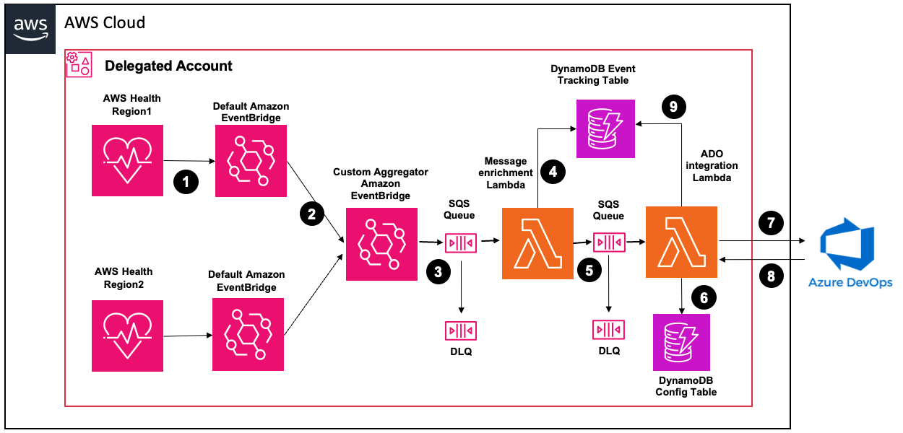

# AWS HealthCompass - Azure DevOps (ADO) Integration

**AWS HealthCompass Azure DevOps Integration** is a serverless solution that converts AWS Health planned lifecycle events into actionable work items in Azure DevOps. This solution reduces operational overhead by automating the creation and management of ADO work items for AWS Health planned lifecycle events, ensuring resource owners are notified about relevant changes through configurable routing capabilities.

## Key Features

1. **Automated Work Item Management**: Automatically creates Azure DevOps Feature and Child Task work items for AWS Health planned lifecycle events, eliminating manual monitoring and ticket creation while ensuring consistent documentation of infrastructure changes.

2. **Event-Driven Architecture**: Leverages a serverless, event-driven design that processes events in near real-time with minimal operational overhead, automatically scaling to handle event volume fluctuations.

3. **Flexible Routing Models**: Supports three deployment models:
   - **Account-based routing**: Directs work items based on affected AWS accounts
   - **Service-based routing**: Organizes work items by AWS service type (EC2, S3, etc.)
   - **Tag-based routing**: Directs work items based on resource tags, enabling team-specific notifications

4. **Intelligent Work Item Updates**: Updates existing work items when new resources are affected by the same AWS Health event, preventing duplicate items and providing consolidated tracking. Updates are posted as comments on the existing Feature work item. Optionally, when `EnableAutoActivate` is enabled, the Feature status is set to "Active" and reassigned to the current sprint iteration.

5. **Two-Level Work Item Hierarchy**: Creates a parent Feature work item with full event details, and a linked Child Task for the operations team to track effort. Both Feature and Child Task share the same Iteration Path (when configured). The Child Task's Effort field is left empty for the task owner to populate.

6. **Cross-Organization Visibility**: Aggregates health events across all accounts, providing comprehensive visibility through a single deployment.

7. **Resilient Message Processing**: Implements dead letter queues with configurable retry policies to handle processing failures, ensuring no events are lost.

8. **Secure Credential Management**: Uses AWS Secrets Manager to securely store and manage Azure DevOps Personal Access Token (PAT).

## Architecture

 

The solution consists of the following components:

1. **AWS Health Events**: Supports single account or event aggregation across Organization using AWS Health's organizational view with delegated account feature.

2. **AWS EventBridge**: Combines AWS default EventBridge and a custom EventBridge bus to efficiently aggregate and route AWS Health planned lifecycle events across an organization.

3. **AWS Lambda Functions**:
   - **HealthEventProcessorLambda**: Processes incoming AWS Health events, categorizes resources, and prepares messages for work item creation or updates
   - **HealthEventADOIntegration**: Creates and updates Azure DevOps work items based on processed AWS Health events using the [ADO REST API](https://learn.microsoft.com/en-us/rest/api/azure/devops/wit/work-items). For each event, it creates a parent Feature with full event details and a linked Child Task for operational tracking.

4. **SQS Queues**: Provides buffering and resilience between Lambda components with Dead Letter Queue (DLQ) implementation for failed message processing.

5. **AWS Secrets Manager**: Securely stores Azure DevOps PAT.

6. **DynamoDB Tables**: Maintains the relationship between AWS Health events, affected resources, and their corresponding Azure DevOps work items. A routing table maps AWS identifiers to ADO projects and Area Paths based on the deployment model.

7. **IAM Roles and Policies**: Provides appropriate permissions for Lambda execution and cross-account access (Tag model only).

## Prerequisites

1. **AWS Health Organizational View**: Enable [AWS Health organizational view](https://docs.aws.amazon.com/health/latest/ug/enable-organizational-view.html) and [AWS Health delegated account](https://docs.aws.amazon.com/health/latest/ug/delegated-administrator-organizational-view.html) to aggregate events across your organization.

2. **Deployment Account**: Deploy the solution in the AWS Health delegated account (referenced as `deployment-account`).

3. **Azure DevOps Instance**:
   - Azure DevOps organization URL (e.g., `https://dev.azure.com/your-organization`)
   - Personal Access Token (PAT) with **Work Items: Read & Write** scope (`vso.work_write`)
   - Target ADO project name(s) — the project's process template must support **Feature** and **Task** work item types

   > **Note on Work Item Types**: The solution creates a Feature (parent) and Task (child) hierarchy. This requires a process template that supports both types:
   > - **Agile**: ✅ Feature, Task
   > - **Scrum**: ✅ Feature, Task
   > - **CMMI**: ✅ Feature, Task
   > - **Basic**: ❌ Does not support Feature
   >
   > Ensure your ADO project uses Agile, Scrum, or CMMI process template.

4. **Deployment Region**: Identify preferred regions for solution deployment. You will configure event forwarding from all other AWS Regions to the deployment region for event aggregation.

5. **S3 Bucket**: S3 bucket for Lambda deployment packages in the deployment account.

6. **Cross-Account Role** (Tag deployment model only):
   - IAM Role name to be used for cross-account access to linked accounts
   - Tag key to monitor for routing events

## Deployment Instructions

### 1. Prepare Lambda Packages

```bash
zip -r HealthEventProcessorLambda.zip HealthEventProcessorLambda.py
zip -r HealthEventADOIntegration.zip HealthEventADOIntegration.py
```

### 2. Upload to S3

1. Login to your `deployment-account`
2. Switch to your preferred deployment region
3. Upload the Lambda zip files to your S3 bucket
4. Ensure CloudFormation has access to this bucket

### 3. Deploy CloudFormation Template

1. Open AWS CloudFormation console in your deployment account
2. Select "Create Stack" → "With new resources (standard)"
3. Choose "Upload a template file" → Select `cloudformation.yaml`
4. Click "Next"
5. Provide the following parameters:

#### Required Parameters

| Parameter | Description | Example |
|-----------|-------------|---------|
| **Stack name** | Name for your CloudFormation stack | `aws-health-ado-integration` |
| **DeployModel** | Deployment model (Account/Service/Tag) | `Account` |
| **ADOOrganizationUrl** | Azure DevOps organization URL | `https://dev.azure.com/your-organization` |
| **ADOPat** | Azure DevOps Personal Access Token | `your-pat-token` |
| **S3BucketName** | S3 bucket containing Lambda packages | `my-lambda-deployment-bucket` |
| **HealthEventProcessorLambdaKey** | S3 key for processor Lambda | `HealthEventProcessorLambda.zip` |
| **HealthEventADOIntegrationLambdaKey** | S3 key for ADO integration Lambda | `HealthEventADOIntegration.zip` |

#### Optional Parameters

| Parameter | Description | Example |
|-----------|-------------|---------|
| **ADOIterationPathPrefix** | Iteration path prefix in ADO. The solution appends a bi-weekly sprint identifier automatically using the format `Sprint N Mon FY YY-YY` (e.g., `Sprint 1 Apr FY 26-27` for the first half of April in financial year 2026-27). If left empty, ADO defaults to the project root iteration. | `VF UK IT Cloud Infrastructure` |
| **ADOAreaPath** | Fixed Area Path for all work items. If set, this overrides DynamoDB-based routing for Area Path assignment. If left empty, Area Path is determined by the Account/Service/Tag routing model via DynamoDB mapping. | `VF UK IT Cloud Infrastructure\Operations and Support` |
| **EnableAutoActivate** | When set to `true`, subsequent Health notifications for already-tracked events will update the Feature status to "Active" and reassign it to the current sprint iteration. Default: `false`. | `true` |
| **ADOCustomFields** | JSON-encoded list of custom fields to include when creating Feature work items. Use this when your ADO project has required custom fields on the Feature work item type. Each entry needs `field` (the ADO field reference name) and `value`. | `[{"field":"Custom.ProjectContacts","value":"Cloud Team"},{"field":"Custom.DomainsorDepartments","value":"Infrastructure"}]` |

#### Conditional Parameters (Tag Model Only)

| Parameter | Description | Example |
|-----------|-------------|---------|
| **AssumeRoleName** | IAM role name for cross-account access | `HealthEventTagRole` |
| **TagKey** | Tag key to monitor for routing | `Environment` |

6. Click "Next" → Configure stack options → Click "Next"
7. Review configuration and select "I acknowledge that AWS CloudFormation might create IAM resources"
8. Click "Create stack"

### 4. Monitor Deployment

Monitor stack creation progress in the CloudFormation console. Once complete, note the outputs for resource details.

## Configuration

### Configure Health Event Aggregation

Create rules to send AWS Health events from default EventBridge to the custom EventBridge bus:

1. **Locate Custom Event Bus**: In your deployment account and region, find the custom EventBridge bus from CloudFormation outputs. Note the custom Event bus ARN.

2. **Create EventBridge Rules** (repeat for each region):
   - Go to EventBridge console → Event buses → Select default Event bus → Create rule
   - **Name**: `health-event-forwarding-rule`
   - **Rule type**: Rule with an event pattern
   - **Event source**: AWS events or EventBridge partner events
   - **Event pattern**: Use pattern form
     - **AWS Service**: Health
     - **Event type**: All events
   - **Target**: EventBridge event bus → select your custom event bus
   - **Execution role**: Create a new role for this specific resource

3. **Repeat for All Regions**: Create similar rules in all AWS regions to forward events to your deployment region.

### Area Path Routing

The solution supports two approaches for assigning the Area Path on work items:

**Single-Route (Fixed Area Path)**: Set the `ADOAreaPath` CloudFormation parameter to a fixed value (e.g., `VF UK IT Cloud Infrastructure\Operations and Support`). All work items will be created under this Area Path regardless of the deployment model. The DynamoDB routing table is still used for project selection, but Area Path is overridden by this parameter. This is ideal for teams where all AWS Health events are handled by a single operations group.

**Multi-Route (DynamoDB-based)**: Leave the `ADOAreaPath` parameter empty. The Area Path is then determined by the Account/Service/Tag routing model via the DynamoDB mapping table. This is ideal for organizations where different teams handle different accounts, services, or tagged resources.

> **Note**: Both approaches can coexist with the three deployment models (Account/Service/Tag). The deployment model always controls which ADO project a work item is routed to. The `ADOAreaPath` parameter only controls whether the Area Path within that project is fixed or dynamically routed.

### Configure DynamoDB Mapping

Configure the DynamoDB routing table with mapping information based on your chosen deployment model. The project name is always required. The Area Path column is only used when the `ADOAreaPath` CloudFormation parameter is left empty (multi-route mode).

1. Locate the DynamoDB table from CloudFormation stack outputs
2. Access the DynamoDB console and select your table
3. Use the PartiQL editor or item creation interface to add mapping entries
4. Always create a `DefaultProjectCode` entry to handle unmapped resources

#### Account Model

```sql
-- Default mapping (catches all for unmapped accounts)
INSERT into "AccountADOTable" value {
    'Account': 'DefaultProjectCode',
    'ACADOProjectName': 'MyADOProject',
    'ACADOAreaPath': 'MyADOProject\\Operations'
}

-- Account-specific mapping
INSERT into "AccountADOTable" value {
    'Account': '123456789012',
    'ACADOProjectName': 'ProductionOps',
    'ACADOAreaPath': 'ProductionOps\\Cloud Infrastructure'
}
```

#### Service Model

```sql
-- Default mapping (catches all for unmapped services)
INSERT into "ServiceADOTable" value {
    'Service': 'DefaultProjectCode',
    'SADOProjectName': 'MyADOProject',
    'SADOAreaPath': 'MyADOProject\\Operations'
}

-- Service-specific mapping
INSERT into "ServiceADOTable" value {
    'Service': 'EC2',
    'SADOProjectName': 'InfraOps',
    'SADOAreaPath': 'InfraOps\\Compute'
}
```

#### Tag Model

```sql
-- Default mapping (catches all for unmapped tag values)
INSERT into "TagADOTable" value {
    'HostTag': 'DefaultProjectCode',
    'HTADOProjectName': 'MyADOProject',
    'HTADOAreaPath': 'MyADOProject\\Operations'
}

-- Tag-specific mapping
INSERT into "TagADOTable" value {
    'HostTag': 'production-web',
    'HTADOProjectName': 'WebOps',
    'HTADOAreaPath': 'WebOps\\Production'
}
```

> **Note**: Replace table names, project names, and Area Paths with your actual values. The Area Path column in the DynamoDB mapping is only used when the `ADOAreaPath` CloudFormation parameter is left empty (multi-route mode). If `ADOAreaPath` is set, it overrides the DynamoDB Area Path for all work items.

### Azure DevOps API Details

The solution interacts with Azure DevOps using the [Work Item Tracking REST API](https://learn.microsoft.com/en-us/rest/api/azure/devops/wit).

#### Creating Work Items

The solution creates a two-level work item hierarchy for each health event: a **Feature** (parent) and a **Child Task** linked to it.

**Step 1: Create the Feature**

The Feature is created using a `POST` request with a JSON Patch document (`application/json-patch+json`):

```
POST https://dev.azure.com/{organization}/{project}/_apis/wit/workitems/$Feature?api-version=7.1
```

Note: The `$` before the type is literal and required by the ADO API.

Example request body:
```json
[
    {
        "op": "add",
        "path": "/fields/System.Title",
        "value": "Account: 123456789012 - AWS EC2 Planned Maintenance - AWS_EC2_PLANNED_LIFECYCLE_EVENT"
    },
    {
        "op": "add",
        "path": "/fields/System.State",
        "value": "New"
    },
    {
        "op": "add",
        "path": "/fields/System.AreaPath",
        "value": "MyProject\\Operations and Support"
    },
    {
        "op": "add",
        "path": "/fields/System.IterationPath",
        "value": "MyProject\\Sprint 1 Apr FY 26-27"
    },
    {
        "op": "add",
        "path": "/fields/System.Description",
        "value": "<p>Event Description: Scheduled maintenance for EC2 instances...</p><p><b>Affected Resources:</b></p><p>Resource: arn:aws:ec2:us-east-1:123456789012:instance/i-1234567890abcdef0<br/>Status: OPEN<br/>Last Updated: 2023-10-15T10:30:00Z</p>"
    },
    {
        "op": "add",
        "path": "/fields/Custom.ProjectContacts",
        "value": "Cloud Team"
    }
]
```

> **Note**: The `System.Description` field accepts HTML content. If your ADO project has custom required fields on the Feature work item type (e.g., `Custom.ProjectContacts`), configure them via the `ADOCustomFields` CloudFormation parameter — they will be appended to the patch document automatically. The `System.IterationPath` is dynamically constructed from the `ADOIterationPathPrefix` CloudFormation parameter using a bi-weekly sprint naming convention (`Sprint N Mon FY YY-YY`). If the prefix is not configured, the iteration path field is omitted and ADO uses the project default.

**Step 2: Create the Child Task**

After the Feature is created, a Child Task is created and linked to the parent Feature using a parent-child relationship:

```
POST https://dev.azure.com/{organization}/{project}/_apis/wit/workitems/$Task?api-version=7.1
```

Example request body:
```json
[
    {
        "op": "add",
        "path": "/fields/System.Title",
        "value": "Task: Account: 123456789012 - AWS EC2 Planned Maintenance - AWS_EC2_PLANNED_LIFECYCLE_EVENT"
    },
    {
        "op": "add",
        "path": "/fields/System.State",
        "value": "New"
    },
    {
        "op": "add",
        "path": "/fields/System.AreaPath",
        "value": "MyProject\\Operations and Support"
    },
    {
        "op": "add",
        "path": "/fields/System.IterationPath",
        "value": "MyProject\\Sprint 1 Apr FY 26-27"
    },
    {
        "op": "add",
        "path": "/relations/-",
        "value": {
            "rel": "System.LinkTypes.Hierarchy-Reverse",
            "url": "https://dev.azure.com/{organization}/{project}/_apis/wit/workItems/{featureId}"
        }
    }
]
```

> **Note**: The Child Task's `Effort` field is intentionally left empty for the task owner to populate during sprint planning. The `System.LinkTypes.Hierarchy-Reverse` relation links the Task as a child of the Feature. When `ADOIterationPathPrefix` is configured, both Feature and Child Task receive the same dynamically constructed Iteration Path.

#### Updating Work Items (Adding Comments)

When new resources are affected by an existing tracked event, the solution adds a comment to the existing Feature work item using the [Comments API](https://learn.microsoft.com/en-us/rest/api/azure/devops/wit/comments/add-comment). The Feature is identified by its integer `id` returned during creation, which is stored in the DynamoDB tracking table as `adoWorkItemId`.

If `EnableAutoActivate` is set to `true`, the solution also updates the Feature's state to "Active" and reassigns it to the current sprint iteration (based on the configured `ADOIterationPathPrefix`). This is done via a `PATCH` request to the Work Items API:

```
PATCH https://dev.azure.com/{organization}/{project}/_apis/wit/workitems/{workItemId}?api-version=7.1
```

Example request body:
```json
[
    {
        "op": "replace",
        "path": "/fields/System.State",
        "value": "Active"
    },
    {
        "op": "replace",
        "path": "/fields/System.IterationPath",
        "value": "MyProject\\Sprint 1 Apr FY 26-27"
    }
]
```

The comment is added using:

```
POST https://dev.azure.com/{organization}/{project}/_apis/wit/workItems/{workItemId}/comments?api-version=7.1-preview.4
```

Example request body:
```json
{
    "text": "Update for resources:<br/><br/>Resource: arn:aws:ec2:us-east-1:123456789012:instance/i-abcdef1234567890<br/>Status: CLOSED<br/>Last Updated: 2023-10-15T14:30:00Z"
}
```

> **Note**: The comment `text` field supports HTML formatting.

#### Work Item Fields Used

**Feature (Parent):**

| Field | Path | Description |
|-------|------|-------------|
| **Title** | `/fields/System.Title` | Summary based on deployment model |
| **State** | `/fields/System.State` | Set to "New" on creation. Updated to "Active" on subsequent notifications if `EnableAutoActivate` is `true`. |
| **Area Path** | `/fields/System.AreaPath` | Fixed via `ADOAreaPath` parameter, or determined by DynamoDB routing model |
| **Iteration Path** | `/fields/System.IterationPath` | Dynamically set from `ADOIterationPathPrefix` + bi-weekly sprint identifier (`Sprint N Mon FY YY-YY`). Updated to current sprint on subsequent notifications if `EnableAutoActivate` is `true`. |
| **Description** | `/fields/System.Description` | AWS Health event description with affected resource details (HTML) |
| **Custom Fields** | As configured via `ADOCustomFields` | Any additional required fields defined by your ADO process template |

**Child Task:**

| Field | Path | Description |
|-------|------|-------------|
| **Title** | `/fields/System.Title` | Prefixed with "Task: " followed by the Feature title |
| **State** | `/fields/System.State` | Set to "New" on creation |
| **Area Path** | `/fields/System.AreaPath` | Same as parent Feature |
| **Iteration Path** | `/fields/System.IterationPath` | Same as parent Feature (dynamically set when `ADOIterationPathPrefix` is configured) |
| **Effort** | `/fields/Microsoft.VSTS.Scheduling.Effort` | Left empty — task owner populates during sprint planning |
| **Parent Link** | `/relations/-` | Linked to parent Feature via `System.LinkTypes.Hierarchy-Reverse` |

#### Title Format by Deployment Model

| Model | Title Format |
|-------|-------------|
| Account | `Account: 123456789012 - AWS EC2 Planned Maintenance - AWS_EC2_PLANNED_LIFECYCLE_EVENT` |
| Service | `Service: EC2 - AWS EC2 Planned Maintenance - AWS_EC2_PLANNED_LIFECYCLE_EVENT - Service Based` |
| Tag | `Tag: production-web - AWS EC2 Planned Maintenance - AWS_EC2_PLANNED_LIFECYCLE_EVENT - Tag Based` |

### Create Cross-Account IAM Role (Tag Model Only)

Create the following role in every linked account:

**Role Permission Policy:**
```json
{
    "Version": "2012-10-17",
    "Statement": [
        {
            "Effect": "Allow",
            "Action": [
                "tag:GetResources",
                "tag:GetTagKeys",
                "tag:GetTagValues"
            ],
            "Resource": "*"
        },
        {
            "Effect": "Allow",
            "Action": [
                "s3:GetBucketTagging",
                "iam:ListRoleTags",
                "iam:ListUserTags",
                "route53:ListTagsForResource",
                "autoscaling:DescribeTags"
            ],
            "Resource": "*"
        }
    ]
}
```

**Role Trust Policy:**
```json
{
    "Version": "2012-10-17",
    "Statement": [
        {
            "Effect": "Allow",
            "Principal": {
                "AWS": "arn:aws:iam::<deployment-account-id>:role/<stack-name>-HealthEventProcessorRole-<random-suffix>"
            },
            "Action": "sts:AssumeRole"
        }
    ]
}
```

> **Note**: Replace `<deployment-account-id>` and `<stack-name>` with your actual values. The processor role name can be found in CloudFormation outputs.

## Testing the Solution

### 1. Verify Deployment

Check CloudFormation stack outputs for:
- DynamoDB table name
- Lambda function ARNs
- SQS queue URLs
- ADO secret name

### 2. Test ADO Connectivity

1. Use the ADO Integration Lambda function test console with a sample event
2. Check CloudWatch Logs for both Lambda functions
3. Verify ADO PAT in Secrets Manager is correct and not expired

### 3. Simulate Health Events

Test with sample events from the `test/` directory (if available), or wait for a real AWS scheduled maintenance event.

### 4. Monitor Processing

1. **SQS Queues**: Check for messages in processing queues
2. **DLQ**: Monitor dead letter queues for failed messages
3. **CloudWatch Logs**: Review Lambda execution logs
4. **Azure DevOps**: Verify Feature and Child Task work items are created in the correct projects, and that the parent-child link between them is intact

## Troubleshooting

### Common Issues

#### 1. Lambda Function Errors
- Check CloudWatch Logs for error messages
- Verify IAM permissions are correctly configured
- Ensure ADO PAT is valid and has the `vso.work_write` scope
- Validate ADO organization URL is accessible from Lambda

#### 2. ADO Authentication Failures (HTTP 401/403)
- Verify PAT in Secrets Manager is valid and not expired
- Ensure PAT has **Work Items: Read & Write** scope
- Check that the ADO organization URL is correct (format: `https://dev.azure.com/{organization}`)
- Test PAT manually:
  ```bash
  curl -u :<your-pat> \
       "https://dev.azure.com/<organization>/_apis/projects?api-version=7.1"
  ```

#### 3. Work Item Creation Failures (HTTP 400)
- Verify the project's process template supports Feature and Task work item types (Agile, Scrum, or CMMI)
- Ensure the ADO project name in DynamoDB mapping matches the actual project name exactly (case-sensitive)
- If `ADOIterationPathPrefix` is configured, verify the resulting iteration path (e.g., `MyProject\Sprint 1 Apr FY 26-27`) exists in the ADO project. Sprints must be created in ADO ahead of time.
- If using multi-route mode, check that the Area Path in the DynamoDB mapping exists in the ADO project
- If using single-route mode, check that the `ADOAreaPath` CloudFormation parameter value exists in the ADO project
- If the error mentions `RuleValidationErrors` with `Required, InvalidEmpty` for custom fields, your ADO process template has mandatory custom fields on the Feature work item type. Use the `ADOCustomFields` CloudFormation parameter (or Lambda environment variable `ADO_CUSTOM_FIELDS`) to provide values for these fields. See the [Optional Parameters](#optional-parameters) section for the JSON format.

#### 4. Missing Work Items
- Check SQS queues for stuck messages
- Verify EventBridge rules are properly configured
- Review DynamoDB tracking table for event records

#### 5. Feature Created Without Child Task
- If the Feature was created successfully but the Child Task creation failed, check CloudWatch Logs for errors on the second API call
- Common causes: Area Path or Iteration Path valid for Feature but not for Task in the project's process template
- The Feature will exist in ADO without a child — manually create the Task or reprocess the event after fixing the issue

#### 6. Cross-Account Tag Discovery Issues (Tag Model)
- Verify IAM roles are correctly set up in all accounts
- Check trust relationships between accounts
- Ensure tag permissions are properly configured
- Test role assumption manually using AWS CLI

### Debugging Steps

1. **Check CloudWatch Logs**:
   ```bash
   aws logs describe-log-groups --log-group-name-prefix "/aws/lambda/your-stack-name"
   ```

2. **Monitor SQS Queues**:
   ```bash
   aws sqs get-queue-attributes --queue-url <queue-url> --attribute-names All
   ```

3. **Verify DynamoDB Records**:
   ```bash
   aws dynamodb scan --table-name <tracking-table-name>
   ```

4. **Test ADO API - List Projects**:
   ```bash
   curl -u :<your-pat> \
        "https://dev.azure.com/<organization>/_apis/projects?api-version=7.1"
   ```

5. **Test ADO API - Get Work Item**:
   ```bash
   curl -u :<your-pat> \
        "https://dev.azure.com/<organization>/<project>/_apis/wit/workitems/<id>?api-version=7.1"
   ```

## Security Considerations

- ADO PAT is stored securely in AWS Secrets Manager
- IAM roles follow least privilege principle
- ADO communication occurs over HTTPS
- Consider implementing VPC endpoints for enhanced security
- Regularly rotate ADO Personal Access Tokens (PATs have a maximum lifetime of 1 year)
- Use a dedicated service account for the PAT rather than a personal user account

## License

This library is licensed under the MIT-0 License. See the LICENSE file.
